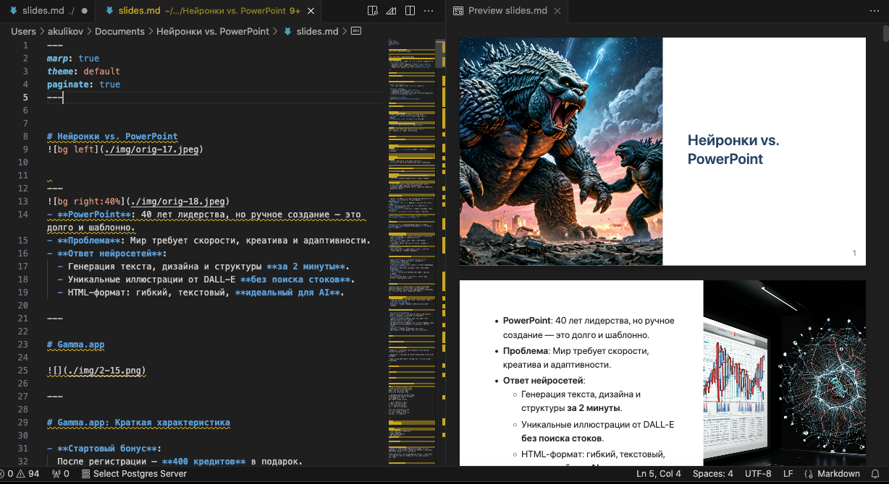
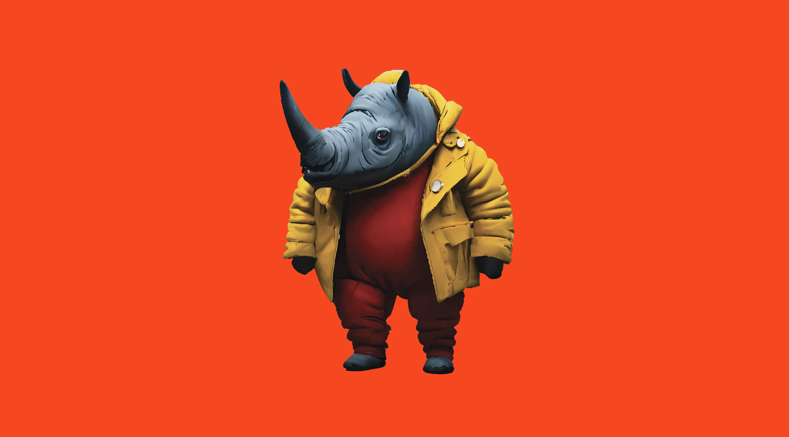
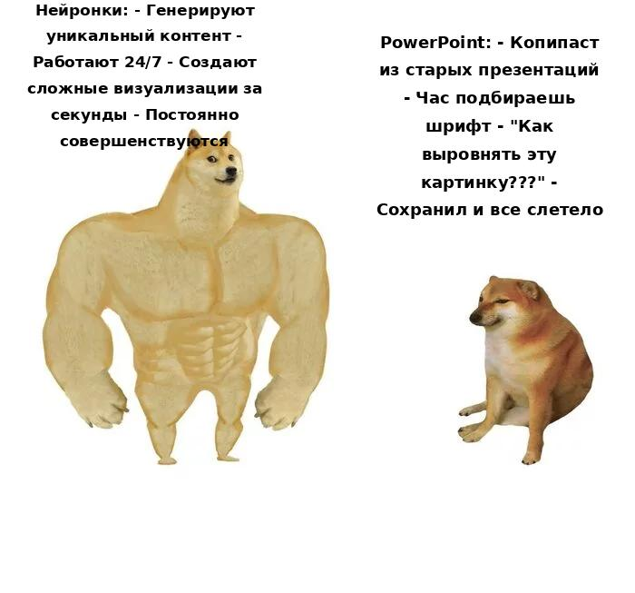

# Нейронки vs. PowerPoint


---

- **PowerPoint**: 40 лет лидерства, но ручное создание — это долго и шаблонно.
- **Проблема**: Мир требует скорости, креатива и адаптивности.
- **Ответ нейросетей**:
  - Генерация текста, дизайна и структуры **за 2 минуты**.
  - Уникальные иллюстрации от DALL-E **без поиска стоков**.
  - HTML-формат: гибкий, текстовый, **идеальный для AI**.

---

# Gamma.app


---

# Gamma.app: Краткая характеристика

- **Стартовый бонус**:  
  После регистрации — **400 кредитов** в подарок.  

- **Стоимость услуг**:  
  - Создание презентации: **40 кредитов**.  
  - Добавление нового слайда: **5 кредитов**.  
  - Дополнительные функции (расширение текста, подсказки ИИ и т.д.): **от 2 до 10 кредитов**.  

- **Бесплатный доступ**:  
  Хватит на **1–2 полноценные презентации**.  

---

# [Пример презентации Gamma.app](./pdf/Nejronki-protiv-PowerPoint-Bitva-Titanov-Cifrovoj-Ery.pdf)

---
# Prezo.ai


---

## Недостатки
- **Непослушный ИИ**:  
  — Иллюстрации иногда "красивые, но не по теме".  
- **Проблемы с русским языком**: Текст генерируется с ошибками.  
- **Ограниченный экспорт**: Только в формате PDF.

## Стоимость
- **Бесплатно**: До 5 презентаций.  
- **Платно**: $8/месяц после исчерпания лимита.

## Итог
Prezo.ai — инструмент для **базовых набросков** с иллюстрациями, но требует ручной правки.

---

# [Пример презентации Prezo.ai](./pdf/Настоящая%20сила_%20Нейросети%20против%20Презентаций.pdf)

---

# SlidesAI


---

## Недостатки
- **Ошибки**: Возможны неточности при работе со сложными данными.
- **Зависимость от интернета**: Требуется стабильное соединение.


## Стоимость
- **Бесплатно**: До 12 презентаций в год (до 2500 символов каждая).
- **Pro**: $8/месяц — расширенные возможности.
- **Premium**: $15/месяц — увеличенный объем и функционал.


---

# [Пример презентации SlidesAI](./pdf/Новая%20презентация.pdf)

---

# Главный недостаток этих сервисов

## Они все платные!!!

## Что внутри?
- **ChatGPT**: Генерация текста, структуры и идей для презентаций.
- **DALL-E**: Создание уникальных иллюстраций и визуалов.


## Альтернатива
  — Можно использовать другие LLM для генерации текста.  
  — Для иллюстраций: Шедеврум или Кандинский.  
  — Создание HTML-презентаций с помощью библиотек (Reveal.js, Impress.js, Marp).  

---


# HTML презентации

- Работают в браузере, не требуют установки дополнительного ПО.
- **Гибкость**: Полный контроль над дизайном и функциональностью.
- **Кроссплатформенность**: Запускаются на любом устройстве с браузером.
- **AI-friendly**: Легко генерируются и редактируются с помощью LLM (ChatGPT и др.).
- **Интерактивность**: Возможность добавлять анимации, видео, 3D-элементы.
- **Легкость интеграции**: Можно встраивать в веб-сайты


**HTML-презентации — это современная, гибкая и мощная альтернатива традиционным инструментам.**

---
# Reveal.js

**Reveal.js** — это JavaScript-библиотека для создания интерактивных и мультимедийных презентаций, которые работают прямо в браузере.

---

## Основные особенности:
- **Интерактивность**:  
  Поддержка анимаций, игр, квизов, голосовалок, комментариев, лайков и интеграции с социальными сетями.
- **Мультимедиа**:  
  Возможность встраивать видео, аудио и 3D-графику.
- **Кроссплатформенность**:  
  Презентации работают на любом устройстве с браузером.
- **Гибкость**:  
  Полный контроль над дизайном и функциональностью 
- **AI-friendly**:  
  Легко генерируется и редактируется с помощью языковых моделей (например, ChatGPT, Deepseek).

---

# Когда использовать Reveal.js?

- **Интерактивные уроки и образовательные проекты**:  
  Идеально для создания материалов с анимациями и интерактивными элементами.
- **Технические презентации**:  
  Поддержка встраивания кода, графиков и сложных визуализаций.
- **Креативные проекты**:  
  Возможность использовать анимации, видео и 3D-графику презентаций.
- **Сайт-визитка**:  
  Простое и стильное представление информации о себе или компании.
- **Портфолио**:  
  Интерактивное портфолио с возможностью демонстрации проектов, изображений и видео.

---

# Impress.js

**Impress.js** — это библиотека для создания презентаций с эффектами 3D-переходов и нестандартной навигацией. Она позволяет создавать впечатляющие и запоминающиеся презентации, которые выходят за рамки традиционных слайдов.

---

## Основные особенности:
- **3D-эффекты**:  
  Поддержка вращения, масштабирования и перемещения слайдов в трёхмерном пространстве.
- **Нестандартная навигация**:  
  Возможность создавать уникальные пути перехода между слайдами.

---
## Когда использовать Impress.js?

- **Креативные презентации**:  
  Идеально для проектов, где важно произвести впечатление с помощью 3D-эффектов и нестандартной навигации.
- **Демонстрация проектов**:  
  Подходит для необычной подачи идей, где слайды могут "путешествовать" в пространстве.
- **Образовательные материалы**:  
  3D-эффекты помогают визуализировать сложные концепции, такие как путешествия, перемещение во времени или трёхмерные модели.
- **Интерактивные истории**:  
  Возможность создавать презентации, где зритель "перемещается" между сценами, как в игре или квесте.

---

# [Пример презентации на Impress.js](./impress_example/Learning%20to%20Design%20is%20Learning%20to%20See.html)

---

# Marp



---

# Markdown
## Основные возможности:
- **Заголовки**: `# Заголовок 1`, `## Заголовок 2`.
- **Списки**:  
  - Элемент списка (`-` или `*`).
  - Нумерованный список (`1.`, `2.`).
- **Жирный текст**: `**жирный**`.
- **Курсив**: `*курсив*`.
- **Ссылки**: `[текст](https://example.com)`.
- **Изображения**: ``.


---

# Список js библиотек
Bespoke.js
deck.js
DZSlides
Flowtime.js
impress.js
Inspire.js
NueDeck
remark
reveal.js
RISE
Shower
Slidy

---

# Когда чем пользоваться?

- Reveal.js - когда нужны мультимедийные и интерактивные возможности веб сайтов.

- Impress.js - когда нужно произвести впечатление красивой 3D анимацией

- Marp - когда нужно побыстрому набросать черновой вариант презентации

---

# GitHub Pages
Позволяет создать статический сайт.
Что нужно:
- зарегистрироваться на github.com
- создать репозиторий с именем <ваш никнейм>.github.io
- скопировать HTML файлы в репозиторий
- сайт будет доступен по адресу: https://<ваш ник>.github.io/ 

---

# DeepSeek 
Легко создаст код HTML презентации.
```
Напиши презентацию на reveal.js со следующим содержанием: ... 
```

---

# Шедеврум & Fusionbrain

 


---

# Sonnet - лучше других пишет стихи

```
О, как стремительно несётся век!
Где прежде царствовал PowerPoint,
Теперь нейронки правят бал,
И новый мир пред нами встал.

Презентаций былых уж не найти следа,
Их заменил искусственный интеллект.
Но не забудем мы того,
Как слайды двигал человек.

Прогресс неумолим, друзья,
Но память прошлого храня,
Мы с восхищением глядим
На то, как мир преобразим.

Пусть нейросети нынче в моде,
Но мысль людская не уйдёт.
В союзе с техникой, в народе,
Она лишь ярче расцветёт.
```

---

# Мемы
@mememator_ai_bot

---

---

# Что почитать?

- [Раскин Джеф - Интерфейс. Новые направления в проектировании компьютерных систем](./pdf/Раскин%20Джеф%20-%20Интерфейс.%20Новые%20направления%20в%20проектировании%20компьютерных%20систем%20-%202007.pdf)
- [Garr Reynolds - Presentation Zen](./pdf/Garr%20Reynolds%20-%20Presentation%20Zen%20(2%20ed)%20(2011).pdf)
- [Дуарте Н. - Iluuminate ](./pdf/Дуарте%20Н.%20-%20Iluuminate%20-%202017.pdf)
- [Дэн Роэм - Рисуй, чтобы победить](./pdf/Дэн%20Роэм%20-%20Рисуй,%20чтобы%20победить%20-%202018.pdf)
---
# Итоги

1. **Нейросети** позволяют автоматизировать создание презентаций.  
2. **Современные сервисы** объединяют возможности ChatGPT для текста и DALL-E для картинок.  
3. **HTML-презентации** — современная альтернатива PowerPoint.  
4. **HTML-формат** удобен для AI, так как основан на тексте и легко адаптируется.

---

# Спасибо за внимание!

